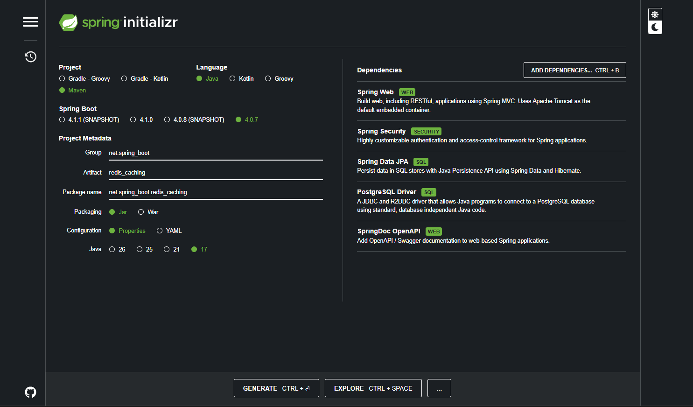
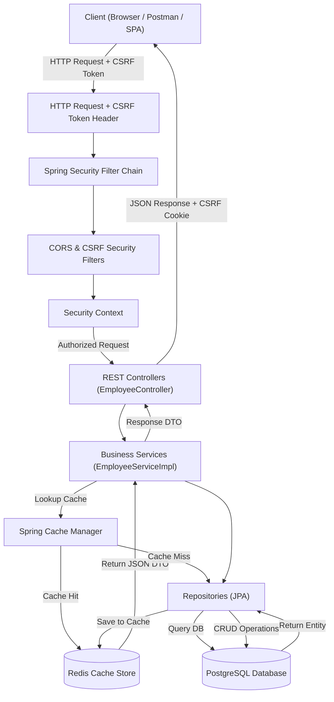
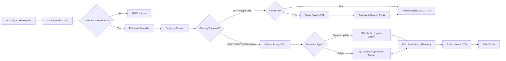
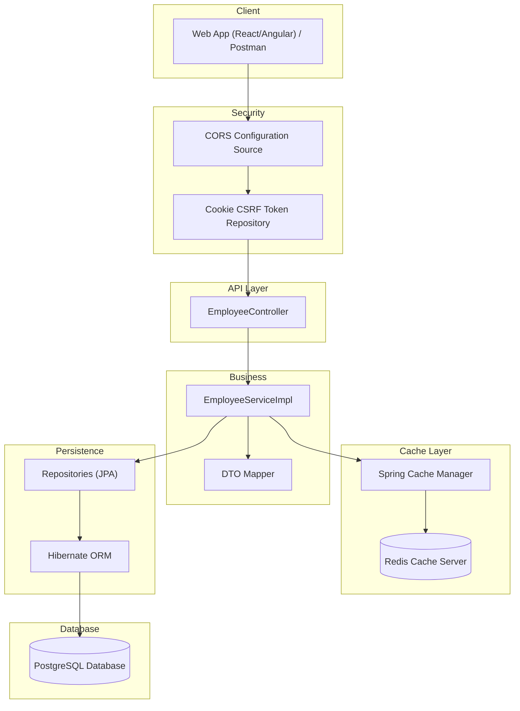
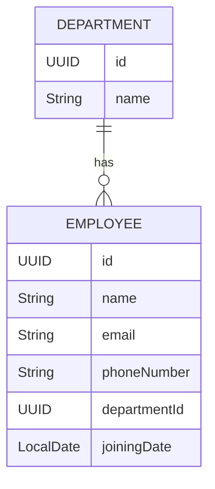

# Employee Management Redis Cache API



A production-quality Spring Boot backend demonstrating how to integrate **Spring Boot 3** with **Redis Caching (Spring Cache)** and **Spring Security (CORS & CSRF protection)**. The application follows a clean layered architecture and performs optimized CRUD operations with database-to-cache synchronization.

## Overview

This project is built to showcase standard caching patterns (read-through, write-through, and cache eviction) alongside standard API security. It covers the complete request flow from receiving an secured HTTP request, verifying CORS and CSRF parameters, accessing cached data in Redis, and querying/persisting to PostgreSQL on cache misses or data changes.

The application uses custom Redis serialization (JSON representation with class types) and manages cache lifetimes automatically.

## Technologies Used

* Java 17+
* Spring Boot 3.2.0
* Spring Security (CORS, CSRF Config)
* Spring Data JPA
* Spring Data Redis (Spring Cache abstraction)
* PostgreSQL
* Maven
* Lombok
* Docker & Docker Compose

## Project Architecture

The project follows a layered architecture where each layer has a single responsibility.



## Caching & Security Flow




## Layered Architecture



## Entity Layer

The entities map directly to database tables. The relationship between `Employee` and `Department` is defined as a standard `Many-to-One` association.

```java
@Entity
@Table(name = "departments")
public class Department {
    @Id
    @GeneratedValue(strategy = GenerationType.UUID)
    private UUID id;

    @Column(nullable = false, unique = true)
    private String name;

    @OneToMany(mappedBy = "department", cascade = CascadeType.ALL, fetch = FetchType.LAZY)
    private List<Employee> employees = new ArrayList<>();
}

@Entity
@Table(name = "employees")
public class Employee {
    @Id
    @GeneratedValue(strategy = GenerationType.UUID)
    private UUID id;

    @Column(nullable = false)
    private String name;

    @Column(nullable = false, unique = true)
    private String email;

    @Column(name = "phone_number", nullable = false)
    private String phoneNumber;

    @ManyToOne(fetch = FetchType.LAZY)
    @JoinColumn(name = "department_id", nullable = false)
    private Department department;

    @Column(name = "joining_date", nullable = false)
    private LocalDate joiningDate;
}
```

## DTO (Data Transfer Object)

DTOs are used to securely transfer data between the API client and the service layer. The `EmployeeDto` implements `Serializable` to allow Redis serialization.

```java
public class EmployeeDto implements Serializable {
    private static final long serialVersionUID = 1L;

    private UUID id;

    @NotBlank(message = "Name is required")
    private String name;

    @NotBlank(message = "Email is required")
    @Email(message = "Invalid email format")
    private String email;

    @NotBlank(message = "Phone number is required")
    private String phoneNumber;

    @NotNull(message = "Department ID is required")
    private UUID departmentId;

    private String departmentName;

    @NotNull(message = "Joining date is required")
    private LocalDate joiningDate;
}
```

## Repository Layer

The repositories extend `JpaRepository`, providing ready-to-use CRUD interfaces and customizable lookup queries.

```java
public interface EmployeeRepository extends JpaRepository<Employee, UUID> {
    Optional<Employee> findByEmail(String email);
}

public interface DepartmentRepository extends JpaRepository<Department, UUID> {
    Optional<Department> findByName(String name);
}
```

## Service Layer

The service encapsulates the business logic. It orchestrates cache reads and updates using declarative caching annotations:
* `@Cacheable`: Checks Redis first; queries PostgreSQL and populates cache on a miss.
* `@CachePut`: Always executes the method (updates PostgreSQL) and saves/overwrites the entry in the cache.
* `@CacheEvict`: Removes outdated records and evicts the cached lists to prevent stale reads.

```java
@Service
@RequiredArgsConstructor
public class EmployeeServiceImpl implements EmployeeService {

    private final EmployeeRepository employeeRepository;
    private final DepartmentRepository departmentRepository;

    @Override
    @Cacheable(value = "employees", key = "#id")
    public EmployeeDto getEmployeeById(UUID id) {
        Employee employee = employeeRepository.findById(id)
                .orElseThrow(() -> new ResourceNotFoundException("Employee not found with ID: " + id));
        return mapToDto(employee);
    }

    @Override
    @Caching(
        put = { @CachePut(value = "employees", key = "#result.id") },
        evict = { @CacheEvict(value = "employees-list", allEntries = true) }
    )
    public EmployeeDto createEmployee(EmployeeDto employeeDto) {
        // ... logic to save to database ...
        return mapToDto(savedEmployee);
    }

    @Override
    @Caching(
        evict = {
            @CacheEvict(value = "employees", key = "#id"),
            @CacheEvict(value = "employees-list", allEntries = true)
        }
    )
    public void deleteEmployee(UUID id) {
        Employee employee = employeeRepository.findById(id)
                .orElseThrow(() -> new ResourceNotFoundException("Employee not found with ID: " + id));
        employeeRepository.delete(employee);
    }
}
```

### Entity Relationship Diagram (ERD)



## Controller Layer

The REST controllers receive raw requests, delegate validation, trigger service operations, and return appropriate HTTP status codes.

```java
@RestController
@RequestMapping("/api/employees")
public class EmployeeController {
    private final EmployeeService employeeService;

    @PostMapping
    public ResponseEntity<EmployeeDto> createEmployee(@Valid @RequestBody EmployeeDto employeeDto) {
        EmployeeDto createdEmployee = employeeService.createEmployee(employeeDto);
        return new ResponseEntity<>(createdEmployee, HttpStatus.CREATED);
    }

    @GetMapping("/{id}")
    public ResponseEntity<EmployeeDto> getEmployeeById(@PathVariable UUID id) {
        return ResponseEntity.ok(employeeService.getEmployeeById(id));
    }
}
```

## Security Configuration

Spring Security is configured to apply standard CORS configurations and secure mutating endpoints using cookie-based CSRF protection.

```java
@Configuration
@EnableWebSecurity
public class AppConfiguraation {

    @Bean
    public SecurityFilterChain securityFilterChain(HttpSecurity http) throws Exception {
        CsrfTokenRequestAttributeHandler requestHandler = new CsrfTokenRequestAttributeHandler();
        requestHandler.setCsrfRequestAttributeName("_csrf");

        http
            .cors(cors -> cors.configurationSource(corsConfigurationSource()))
            .csrf(csrf -> csrf
                .csrfTokenRepository(CookieCsrfTokenRepository.withHttpOnlyFalse())
                .csrfTokenRequestHandler(requestHandler)
            )
            .authorizeHttpRequests(auth -> auth
                .anyRequest().permitAll()
            );

        return http.build();
    }

    @Bean
    public CorsConfigurationSource corsConfigurationSource() {
        CorsConfiguration configuration = new CorsConfiguration();
        configuration.setAllowedOrigins(Arrays.asList("http://localhost:3000", "http://localhost:4200", "http://localhost:8080"));
        configuration.setAllowedMethods(Arrays.asList("GET", "POST", "PUT", "DELETE", "OPTIONS", "PATCH"));
        configuration.setAllowedHeaders(Arrays.asList("Authorization", "Cache-Control", "Content-Type", "X-XSRF-TOKEN"));
        configuration.setExposedHeaders(Collections.singletonList("X-XSRF-TOKEN"));
        configuration.setAllowCredentials(true);
        configuration.setMaxAge(3600L);

        UrlBasedCorsConfigurationSource source = new UrlBasedCorsConfigurationSource();
        source.registerCorsConfiguration("/**", configuration);
        return source;
    }
}
```

## Exception Handling

A global exception handler catches specific business exceptions and structures a clean, predictable response payload.

```java
@RestControllerAdvice
public class GlobalExceptionHandler {

    @ExceptionHandler(ResourceNotFoundException.class)
    public ResponseEntity<Map<String, Object>> handleNotFound(ResourceNotFoundException ex) {
        Map<String, Object> body = new LinkedHashMap<>();
        body.put("timestamp", LocalDateTime.now());
        body.put("status", HttpStatus.NOT_FOUND.value());
        body.put("error", "Not Found");
        body.put("message", ex.getMessage());
        return new ResponseEntity<>(body, HttpStatus.NOT_FOUND);
    }
}
```

## Security & CORS Matrix

| Endpoint | HTTP Method | Access Level | CSRF Token Required | Cache Impact |
|---|---|---|---|---|
| `/api/employees` | GET | `permitAll()` | ❌ No | Reads List Cache |
| `/api/employees/{id}` | GET | `permitAll()` | ❌ No | Reads Item Cache |
| `/api/employees` | POST | `permitAll()` | ✅ Yes (`XSRF-TOKEN`) | Evicts List Cache |
| `/api/employees/{id}` | PUT | `permitAll()` | ✅ Yes (`XSRF-TOKEN`) | Updates Item & Evicts List Cache |
| `/api/employees/{id}` | DELETE | `permitAll()` | ✅ Yes (`XSRF-TOKEN`) | Evicts Item & List Cache |

## Local Setup & Run Instructions

### Prerequisites
* Docker & Docker Compose installed
* Java 17+ installed
* Maven installed

### Step 1: Start PostgreSQL and Redis
Run the following from the root directory to boot the local database and caching infrastructure:
```bash
docker compose up -d
```
*Note: The local PostgreSQL is mapped to port **5433** on the host to avoid port conflicts with standard system services.*

### Step 2: Build & Run the App
To start the Spring Boot application locally:
```bash
# On Windows
mvnw.cmd spring-boot:run

# On Linux / macOS
./mvnw spring-boot:run
```

## Containerization (Dockerization)

The project includes a multi-stage `Dockerfile` and a `.dockerignore` file in the root directory for standard deployments.

### Build and Run using Docker:
1. Build the lightweight production image:
   ```bash
   docker build -t employee-cache-api:latest .
   ```
2. Run the application:
   ```bash
   docker run -p 8080:8080 --name employee-api --network host employee-cache-api:latest
   ```

## How to Test Caching

### 1. Watch Console SQL Statements
* Execute a GET call: `curl http://localhost:8080/api/employees/{id}`.
* Observe the console logs; you will see the Hibernate SELECT query execute.
* Execute the same GET call immediately after.
* No SQL queries are executed. The request is processed instantly as a **Cache Hit** from Redis.

### 2. Inspect Redis CLI Keys
Verify cached items directly in the Redis container:
```bash
# Connect to container
docker exec -it caching-redis redis-cli

# View cache keys
127.0.0.1:6379> keys *
1) "employees::uuid-value-here"
2) "employees-list::all"
```
